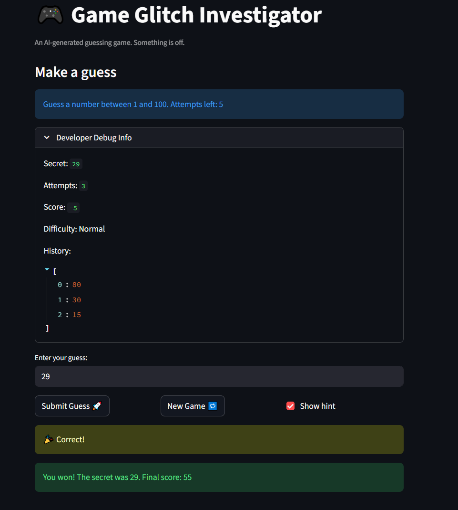
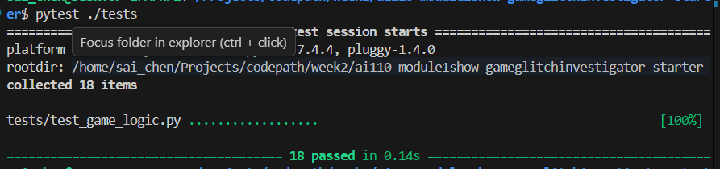

# 🎮 Game Glitch Investigator: The Impossible Guesser

## 🚨 The Situation

You asked an AI to build a simple "Number Guessing Game" using Streamlit.
It wrote the code, ran away, and now the game is unplayable. 

- You can't win.
- The hints lie to you.
- The secret number seems to have commitment issues.

## 🛠️ Setup

1. Install dependencies: `pip install -r requirements.txt`
2. Run the broken app: `python -m streamlit run app.py`

## 🕵️‍♂️ Your Mission

1. **Play the game.** Open the "Developer Debug Info" tab in the app to see the secret number. Try to win.
2. **Find the State Bug.** Why does the secret number change every time you click "Submit"? Ask ChatGPT: *"How do I keep a variable from resetting in Streamlit when I click a button?"*
3. **Fix the Logic.** The hints ("Higher/Lower") are wrong. Fix them.
4. **Refactor & Test.** - Move the logic into `logic_utils.py`.
   - Run `pytest` in your terminal.
   - Keep fixing until all tests pass!

## 📝 Document Your Experience

- [ ] Describe the game's purpose.
- [ ] Detail which bugs you found.
- [ ] Explain what fixes you applied.

## ✨ Challenge 2 Feature: Persistent High Score

The game now saves your best winning score to a local `high_score.json` file.

- The sidebar shows the current best score, the difficulty where it happened, and how many attempts it took.
- A new record is written to disk after a win.
- Tied scores are broken by fewer attempts, so a cleaner win can replace an older record.

### 🤖 How the agent contributed

Agent mode helped plan the feature in three steps:

1. Separate the file persistence logic into testable helpers inside `logic_utils.py`.
2. Wire the saved high score into Streamlit session state so the sidebar updates immediately after a win.
3. Add `pytest` coverage for missing files, first-save behavior, and score tie-break rules.

## 📸 Demo

- 

## 🚀 Stretch Features

## ✨ Challenge 4: Enhanced Game UI

The player experience now includes a more structured interface:

- Color-coded hot, warm, cold, and perfect hint cards after each valid guess.
- Quick-glance stat cards for score, attempts left, and saved best score.
- A session summary table that shows each guess, direction, heat state, distance,
  and score impact.

### Screenshot of the enhanced player experience

