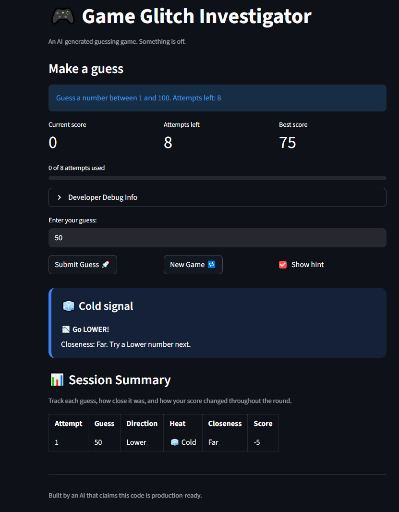
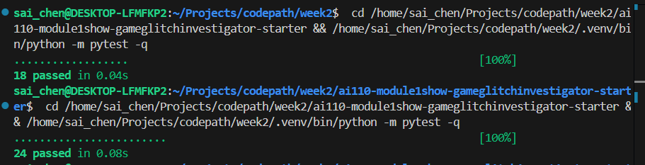

# 🎮 Game Glitch Investigator

A Streamlit number-guessing game that started as a bug-hunt exercise and was
expanded with persistent scoring and a more structured UI.

## Overview

Players guess a secret number within a difficulty-based range and attempt limit.
After each guess, the game provides directional hints and qualitative heat
feedback (Hot/Warm/Cold) while tracking score and attempt history.

## Project Reflection

### 1) Game Purpose

The purpose of this game is to create an interactive number-guessing challenge
where players use hint feedback to find a hidden number within limited attempts.
The project also demonstrates state management, game-logic design, and testing
in a Streamlit application.

### 2) Bugs Found

- Session state bugs caused inconsistent gameplay resets (attempts/status).
- Hint direction logic was inverted in some outcomes.
- Type corruption made some win checks fail due to int/string mismatch.
- Difficulty range handling was inconsistent in specific flows.
- Win score calculation had an off-by-one issue.
- UI feedback revealed too much information (exact distance/secret spoilers).

### 3) Fixes Applied

- Standardized session initialization and new-game reset behavior.
- Corrected higher/lower hint logic and removed unsafe type paths.
- Kept secret values consistently typed during comparisons.
- Unified range usage by difficulty across game setup and resets.
- Corrected scoring math and added a minimum score floor.
- Added persistent high-score tracking with file-backed storage.
- Upgraded the UI with structured heat feedback and summary tables.
- Reworked hints/status messages to avoid exposing the answer directly.
- Added and updated tests so changes are validated with `pytest`.

## Features

- Difficulty modes with different ranges and attempt limits:
   - Easy: 1–20
   - Normal: 1–100
   - Hard: 1–500
- Scoring system based on outcomes and attempt number
- Persistent high score saved locally to `high_score.json`
- Enhanced UI with:
   - Heat-guide hints (🔥 Hot / 🌤️ Warm / 🧊 Cold / 🎯 Perfect)
   - Player stat cards (score, attempts left, best score)
   - Session summary table for each attempt
- Automated tests for core game logic and feature helpers

## Tech Stack

- Python 3.12+
- Streamlit
- Pytest

## Setup

1. Clone the repository
2. Create and activate a virtual environment
3. Install dependencies

```bash
python -m venv .venv
source .venv/bin/activate
pip install -r requirements.txt
```

## Run the App

```bash
python -m streamlit run app.py
```

## Run Tests

```bash
pytest
```

## Challenge 2: Persistent High Score

The game now persists your best winning score and displays it in the sidebar.

- High score includes score value, difficulty, and attempts used
- Records are written to `high_score.json`
- Tie-breaker logic prefers fewer attempts when scores are equal

### How Agent Mode contributed

Agent Mode was used to:

1. Plan helper-based persistence logic in `logic_utils.py`
2. Integrate high-score loading/updating into Streamlit session flow
3. Add test coverage for missing file, first save, and tie-break behavior

## Challenge 4: Enhanced Game UI

The UI was upgraded to make gameplay feedback more readable and engaging:

- Color-coded hint panel with emoji-based heat states
- Structured round summary table
- Clear post-game status messaging without revealing the answer in hints

### Enhanced UI Screenshot



## Additional Screenshot


